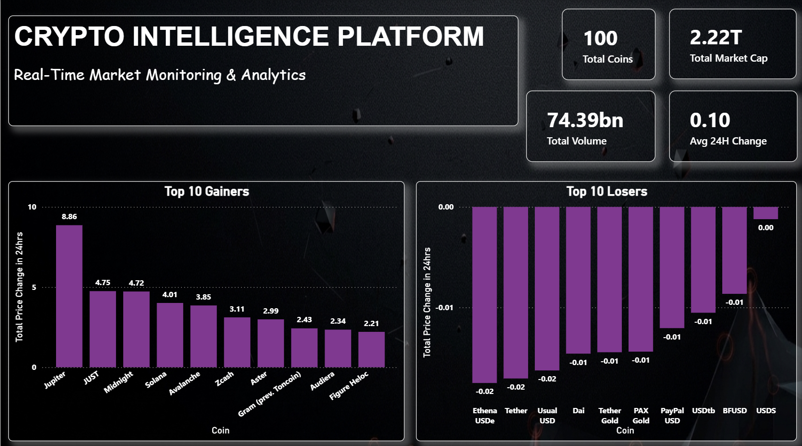
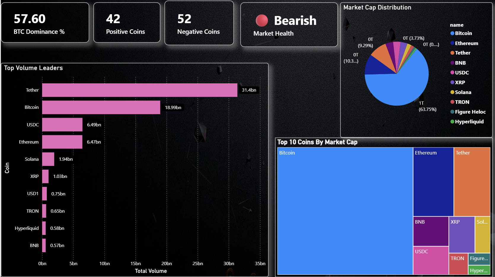
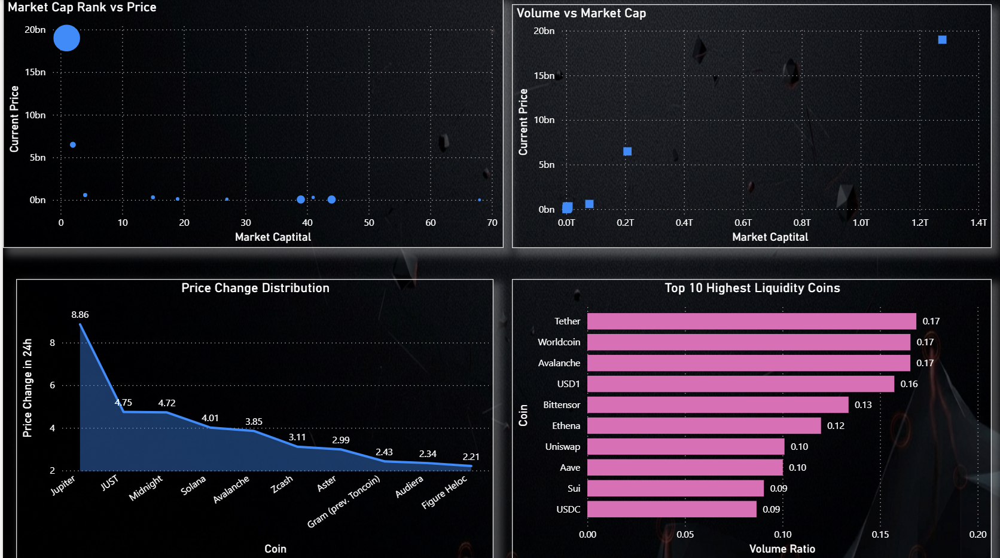
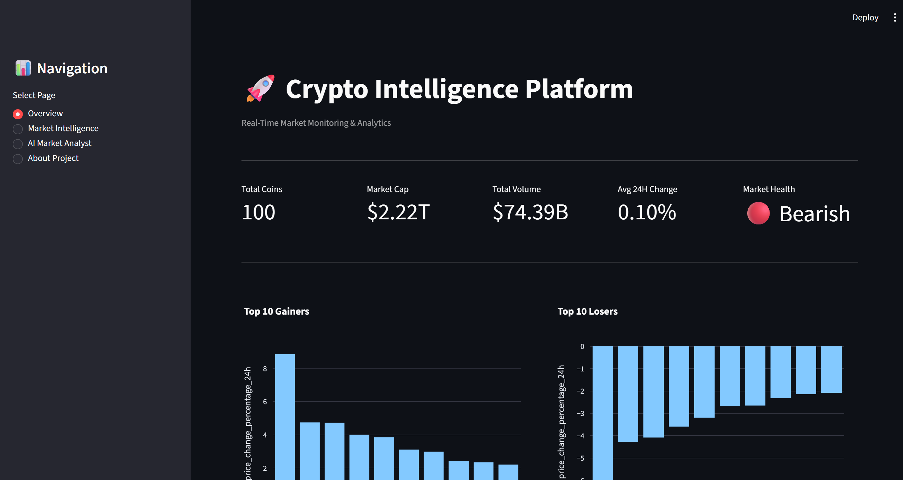
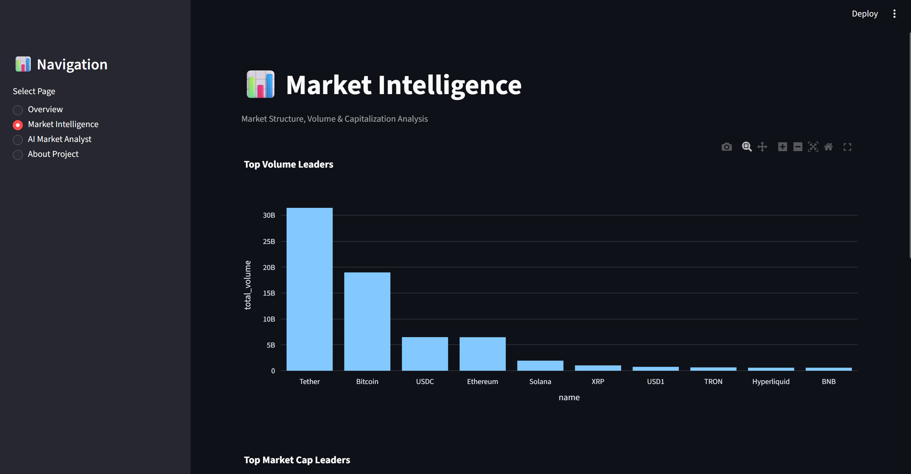
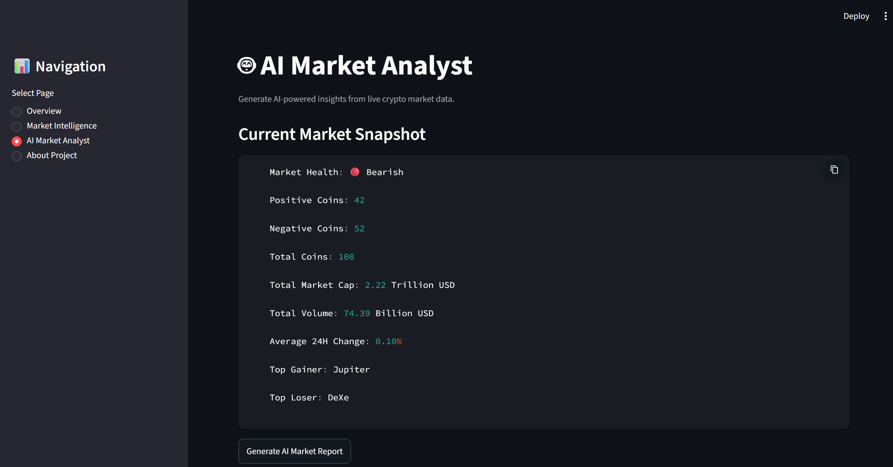

# 🚀 Crypto Intelligence Platform

A Real-Time Cryptocurrency Analytics Platform built using **Python, CoinGecko API, SQLite, Power BI, Streamlit, Plotly, and Gemini AI**.

The platform collects live cryptocurrency market data, processes it through a modern Data Engineering pipeline, stores it in SQLite, visualizes insights using Power BI and Streamlit, and generates AI-powered market reports using Google Gemini.

---

## 🌐 Live Demo

Streamlit Cloud: https://kkd9lh2h9sstchadvjvbc3.streamlit.app/

---

# 📌 Project Overview

The Crypto Intelligence Platform is designed to monitor cryptocurrency markets in real time and provide actionable insights through interactive dashboards and AI-generated analysis.

The project follows a complete analytics workflow:

```text
CoinGecko API
      ↓
 Bronze Layer (Raw JSON)
      ↓
 Silver Layer (Cleaned Data)
      ↓
 SQLite Database
      ↓
 Power BI Dashboard
      ↓
 Streamlit Dashboard
      ↓
 Gemini AI Market Analyst
```

---

# 🎯 Business Objectives

- Monitor live cryptocurrency market activity
- Identify top gainers and losers
- Analyze market capitalization distribution
- Track liquidity and trading volume
- Evaluate overall market health
- Generate AI-powered market reports
- Create executive dashboards for decision-making

---

# 🏗️ Architecture

```text
┌───────────────────┐
│   CoinGecko API   │
└─────────┬─────────┘
          │
          ▼
┌───────────────────┐
│ Bronze Layer      │
│ Raw JSON Storage  │
└─────────┬─────────┘
          │
          ▼
┌───────────────────┐
│ Silver Layer      │
│ Data Cleaning     │
└─────────┬─────────┘
          │
          ▼
┌───────────────────┐
│ SQLite Database   │
└─────────┬─────────┘
          │
 ┌────────┴────────┐
 ▼                 ▼
Power BI      Streamlit
Dashboard     Dashboard
                     │
                     ▼
              Gemini AI
              Market Analyst
```

---

# 📂 Project Structure

```text
crypto-intelligence-platform/
│
├── data/
│   ├── bronze/
│   └── silver/
│
├── database/
│   └── crypto.db
│
├── notebook/
│   └── crypto_analysis.ipynb
│
├── powerbi/
│   └── crypto_dashboard.pbix
│
├── screenshots/
│
├── scripts/
│   ├── extract.py
│   ├── transform.py
│   └── ai_analyst.py
│
├── app.py
├── requirements.txt
├── .gitignore
└── README.md
```

---

# ⚙️ Tech Stack

## Programming

- Python

## Data Engineering

- Requests
- JSON
- SQLite
- Pandas

## Visualization

- Power BI
- Streamlit
- Plotly

## AI

- Google Gemini
- Google AI Studio

## Version Control

- Git
- GitHub

---

# 📊 Power BI Dashboard

The Power BI solution consists of three dashboard pages.

## Dashboard 1 — Market Overview



Features:

- Total Coins
- Total Market Cap
- Total Volume
- Average 24H Change
- Top 10 Gainers
- Top 10 Losers

---

## Dashboard 2 — Market Intelligence



Features:

- BTC Dominance
- Positive Coins
- Negative Coins
- Market Health
- Top Volume Leaders
- Market Cap Distribution
- Treemap Analysis

---

## Dashboard 3 — Advanced Analytics



Features:

- Market Cap vs Price
- Volume vs Market Cap
- Liquidity Analysis
- Price Change Distribution

---

# 🌐 Streamlit Dashboard

Interactive web application providing:

## Overview



- KPI Monitoring
- Top Gainers
- Top Losers
- Liquidity Leaders

## Market Intelligence



- Volume Analysis
- Market Cap Analysis
- Treemap Visualization

## AI Market Analyst



Powered by Google Gemini.

Generates:

- Market Sentiment
- Key Observations
- Risk Assessment
- Trading Opportunities

---

# 🤖 AI Market Analyst

The platform integrates Google Gemini to automatically generate market reports from live cryptocurrency data.

Example:

```text
Market Sentiment: Bearish

Key Observation:
More coins are declining than advancing.

Risk Assessment:
Current market conditions suggest cautious positioning.

Opportunity:
Strong momentum coins may provide short-term trading opportunities.
```

Actual AI Report

```text
Here's an analysis of the live crypto market data:

1. Market Sentiment

Bearish: The market health indicator is explicitly red, with a majority of coins (51 out of 100) experiencing negative movement.
Cautious Optimism (Selective): Despite the overall bearish tone, a positive average 24H change (0.57%) suggests some significant individual gains are occurring, preventing a deeper market-wide decline.

2. Key Observations

Divergence: A significant disparity exists, with strong performers like DeXe defying the broader market weakness, while others like Jupiter face substantial pressure.
Concentrated Movement: The positive average change amidst more negative coins indicates that large-cap or specific narratives are holding up well, pulling the average higher.
Moderate Liquidity: Total volume of $113.71 Billion USD suggests active trading but not extreme panic or euphoric buying.

3. Risk Assessment

Elevated Downside Risk: The prevailing bearish sentiment and majority of losing coins point to potential for further price depreciation.
Increased Volatility: The presence of both a top gainer and top loser highlights significant asset-specific volatility.
Capital Preservation: A cautious approach is warranted; focus on protecting capital and avoiding broad market exposure.

4. Trading Opportunities

Selective Longs: Focus on assets showing clear strength and positive divergence from the overall market (e.g., DeXe), after thorough fundamental and technical analysis.
Shorting Opportunities: Consider shorting fundamentally weak or technically breaking assets, particularly those showing significant downward momentum (e.g., Jupiter).
Rotation Plays: Look for sectors or narratives that are showing early signs of resilience or strength, potentially attracting capital from underperforming areas.

```


---

# 🗄️ Database Schema

Table:

```sql
crypto_market
```

Columns:

| Column | Description |
|----------|------------|
| id | Coin ID |
| symbol | Coin Symbol |
| name | Coin Name |
| current_price | Current Price |
| market_cap | Market Capitalization |
| market_cap_rank | Market Rank |
| total_volume | Trading Volume |
| price_change_percentage_24h | 24 Hour Change |
| circulating_supply | Circulating Supply |
| last_updated | API Update Time |
| fetch_time | ETL Load Time |

---

# 🔄 ETL Pipeline

## Extract

Collects live data from CoinGecko API.

Output:

```text
data/bronze/*.json
```

---

## Transform

Performs:

- Column Selection
- Missing Value Handling
- Datetime Conversion
- Data Validation

Output:

```text
data/silver/*.csv
```

---

## Load

Loads cleaned data into SQLite.

Destination:

```text
database/crypto.db
```

---


# 🚀 Installation

## Clone Repository

```bash
git clone https://github.com/swapitsneil/crypto-intelligence-platform.git

cd crypto-intelligence-platform
```

---

## Create Virtual Environment

### Windows

```bash
python -m venv .venv
```

Activate:

```bash
.venv\Scripts\activate
```

---

### Linux / Mac

```bash
python3 -m venv .venv

source .venv/bin/activate
```

---

## Install Dependencies

```bash
pip install -r requirements.txt
```

---

## Configure Environment Variables

Create:

```text
.env
```

Add:

```env
GEMINI_API_KEY=YOUR_API_KEY
```

Get API Key:

https://aistudio.google.com

---

## Run Streamlit App

```bash
streamlit run app.py
```

---

# ☁️ Streamlit Community Cloud Deployment

This project is fully compatible with:

- Python 3.11 ✅
- Python 3.12 ✅

Recommended:

```text
Python 3.11
```

Why?

- Most stable for Streamlit deployments
- Better package compatibility
- Fewer dependency issues

---

## 📈 Key Insights & Recommendations

### 1. Bitcoin Market Dominance

Bitcoin consistently accounts for the largest share of total cryptocurrency market capitalization, making it the primary driver of overall market sentiment.

**Recommendation:** Monitor Bitcoin price movements and dominance levels closely, as significant changes often influence the performance of altcoins and the broader crypto market.

---

### 2. Trading Volume Concentration

A small number of large-cap cryptocurrencies contribute a significant portion of total market trading volume.

**Recommendation:** High-volume assets provide better liquidity and lower transaction risk, making them more suitable for active trading and short-term strategies.

---

### 3. Market Breadth as a Sentiment Indicator

The ratio of positive to negative coins provides an effective measure of overall market health and investor sentiment.

**Recommendation:** Use market breadth alongside price movements to identify potential trend reversals and confirm bullish or bearish market conditions.

---

### 4. Liquidity Opportunities

Several cryptocurrencies exhibit exceptionally high volume-to-market-cap ratios, indicating strong market participation relative to their size.

**Recommendation:** Assets with strong liquidity often offer better execution quality and may present attractive opportunities for momentum-based trading strategies.

---

### 5. Market Concentration Risk

The cryptocurrency market remains highly concentrated among a small group of leading assets.

**Recommendation:** Investors and analysts should track concentration metrics regularly to evaluate diversification opportunities and assess systemic market risk.

---

### 6. Volatility Monitoring

Top gainers and losers frequently demonstrate large daily price swings, highlighting the highly volatile nature of cryptocurrency markets.

**Recommendation:** Implement risk management practices such as position sizing, stop-loss strategies, and volatility monitoring when evaluating short-term trading opportunities.


---

# 🔮 Future Enhancements

- Historical Price Tracking
- Automated ETL Scheduling
- Cryptocurrency Forecasting
- Portfolio Optimization
- Real-Time Alerts
- RAG-based Crypto Research Assistant
- Multi-Agent Crypto Intelligence System

---

# 👨‍💻 Author

**Swapnil Nicolson Dadel**

Aspiring Data Analyst

Skills:

- Python
- SQL
- Power BI
- Streamlit
- Data Engineering
- Machine Learning
- Generative AI

GitHub: https://github.com/swapitsneil


LinkedIn: https://www.linkedin.com/in/swapnil-nicolson-dadel/

---

# ⭐ If you found this project useful

Please consider starring the repository.

- ⭐ Star the repo
- 🍴 Fork the project
- 📢 Share your feedback

